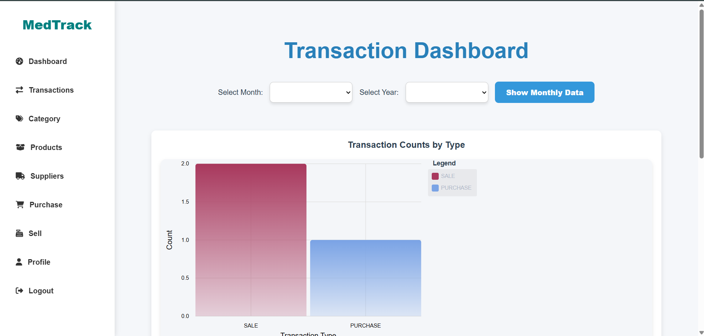

# 💊 MedTrack – Medical Inventory Management System (Frontend)

**MedTrack** is a full-stack role-based Medical Inventory Management System that enables product, supplier, and transaction management for clinics and pharmacies. This repository contains the **Angular frontend**.

> 🔗 **Backend Repo**: [Inventory-Management-System (Spring Boot)](https://github.com/spuffyffets/Inventory-Management-System.git)  
> 🔗 **Frontend Repo**: [frontend (Angular)](https://github.com/spuffyffets/frontend.git)



---

## 🚀 Features

- 🔐 **Role-Based Authentication** (Admin, Manager)
- 📊 **Transaction Dashboard** with Monthly Filter
- ➕ **Add, Edit, Delete**:
  - Transactions (Sales & Purchases)
  - Categories
  - Products
  - Suppliers
- 👤 **User Profile Management**
- 🔁 Secure **Login/Logout**
- 📦 Inventory tracking and management

---

## 🧑‍💻 Technologies Used

- **Frontend**: Angular
- **Backend**: Spring Boot, Hibernate
- **Charting**: Chart.js or Recharts, ngx-charts
- **Security**: JWT Authentication
- **Database**: MySQL (`inventory_db01`)

---

## 📂 Project Structure

> 🔁 This repository contains only the **frontend** (Angular) application.  
> ⚙️ The **backend** (Spring Boot) is hosted in a separate repository.

## 📁 Project Structure (Frontend Only)

```bash
frontend/
 ├── src/
 │   ├── app/
 │   │   ├── auth/          # Login, Register, JWT guards
 │   │   ├── dashboard/     # Analytics Dashboard
 │   │   ├── category/      # Category CRUD
 │   │   ├── products/      # Product CRUD
 │   │   ├── suppliers/     # Supplier CRUD
 │   │   ├── purchase/      # Purchase Transactions
 │   │   ├── sell/          # Sales Transactions
 │   │   ├── profile/       # User Profile
 │   │   ├── shared/        # Navbar, Sidebar, etc.
 │   │   └── app.module.ts
 ├── angular.json
 ├── package.json
 └── README.md

``` 

--- 

## 🔧 Setup Instructions

### ✅ Prerequisites
- 🟢 Node.js & npm installed  
- 🟢 Angular CLI installed:

```bash
npm install -g @angular/cli

```


## Installation (Frontend)
```bash
git clone https://github.com/spuffyffets/frontend.git
cd frontend
npm install
ng serve --open
```

 🚀 App will run at: http://localhost:4200/

 ⚠️ Ensure the backend is running on: http://localhost:5050/  (Check Port no:- in application.properties)

 ✅ Make sure CORS is enabled on backend

🖥️ Backend Setup (Spring Boot)
To enable API functionality:

```bash
git clone https://github.com/spuffyffets/Inventory-Management-System.git
cd Inventory-Management-System
```
- Open in IDE (Eclipse/IntelliJ/VSCode)
- Configure DB (MySQL) and run Spring Boot app


## ✅ Make sure:

MySQL is running

Database inventory_db01 is created

Spring Boot app runs on: http://localhost:5050/ (Check Port no:- in application.properties)


## ✍️ Author

Suchit Chaudhari
📧 suchitchaudhari17@gmail.com